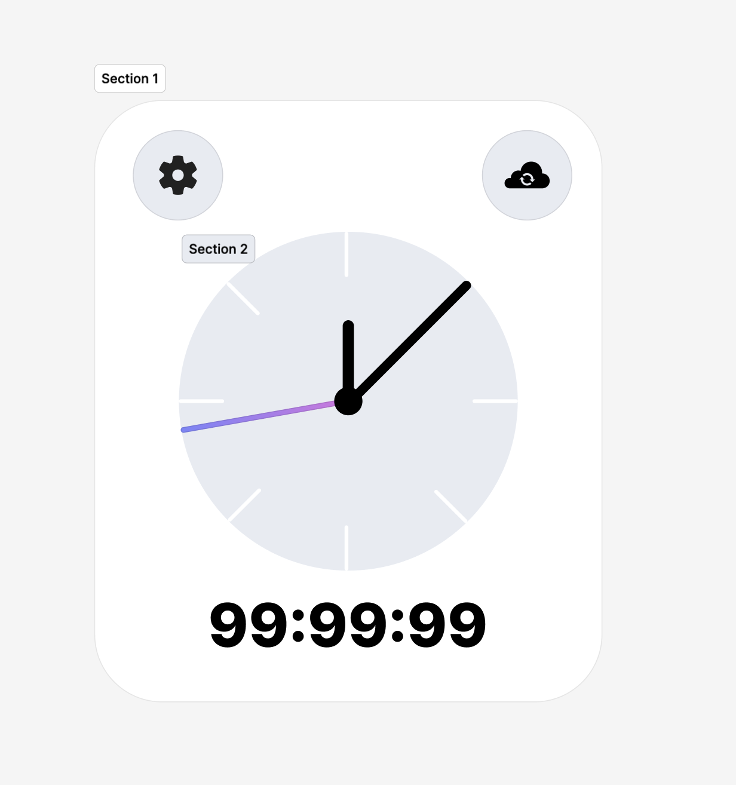

# UnityClock

Unity project **UnityClock**. Test task for sync **Yandex** timestamp and convert it to **Unity DateTime**.

## Links 
[Figma](https://www.figma.com/design/OBGSZ7WbDOPMuA0w5twiB8/Untitled?m=dev&node-id=1-6&t=D0bMi6C5pNSijfFh-1)

